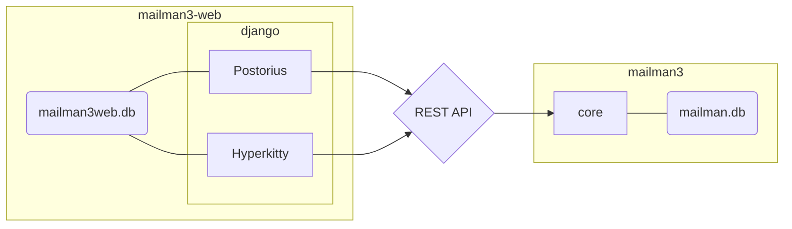

# Mailman 3 suite


## Table des matières
1. [Environnement](#Environnement)
2. [Architecture](#Architecture)
3. [Les bases de donées](#Les-bases-de-donées)
    * [mailman3-web.db](#mailman3\-webdb)
    * [mailman3.db](#mailman3db)
5. [AlternC](#AlternC)
6. [Postfix](#Postfix)
7. [Problème](#Problème)

## Environnement
* Distribution: Debian
* package-version: buster (testing)

## Architecture


[API](https://mailmanclient.readthedocs.io/en/latest/src/mailmanclient/docs/apiref.html)


## Les bases de donées
[[retour en haut]](#Table-des-matières)
### mailman3-web.db
voici à quoi recemeble la base de donnée web.
#### Les tables:

* [django_migrations](#django_migrations)
* [auth_group](#auth_group)
* [auth_group_permissions](#auth_group_permissions)
* [auth_user_groups](#auth_user_groups)
* [auth_user_user_permissions](#auth_user_user_permissions)
* [account_emailconfirmation](#account_emailconfirmation)
* [account_emailaddress](#account_emailaddress)
* [django_admin_log](#django_admin_log)
* [django_content_type](#django_content_type)
* [auth_permission](#auth_permission)
* [auth_user](#auth_user)
* [django_mailman3_profile](#django_mailman3_profile)
* [django_mailman3_maildomain](#django_mailman3_maildomain)
* [django_q_task](#django_q_task)
* [django_q_ormq](#django_q_ormq)
* [django_q_schedule](#django_q_schedule)
* [socialaccount_socialapp_sites](#socialaccount_socialapp_sites)
* [socialaccount_socialtoken](#socialaccount_socialtoken)
* [socialaccount_socialapp](#socialaccount_socialapp)
* [socialaccount_socialaccount](#socialaccount_socialaccount)
* [hyperkitty_vote](#hyperkitty_vote)
* [hyperkitty_tagging](#hyperkitty_tagging)
* [hyperkitty_tag](#hyperkitty_tag)
* [hyperkitty_lastview](#hyperkitty_lastview)
* [hyperkitty_favorite](#hyperkitty_favorite)
* [hyperkitty_profile](#hyperkitty_profile)
* [hyperkitty_sender](#hyperkitty_sender)
* [hyperkitty_thread](#hyperkitty_thread)
* [hyperkitty_email](#hyperkitty_email)
* [hyperkitty_attachment](#hyperkitty_attachment)
* [hyperkitty_threadcategory](#hyperkitty_threadcategory)
* [hyperkitty_mailinglist](#hyperkitty_mailinglist)
* [postorius_emailtemplate](#postorius_emailtemplate)
* [django_session](#django_session)
* [django_site](#django_site)
* [socialaccount_openidnonce](#socialaccount_openidnonce)
* [socialaccount_openidstore](#socialaccount_openidstore)

#### Les donées 
##### django_migrations

     id = 1
    app = contenttypes
   name = 0001_initial
applied = 2019-03-27 15:32:17.426709

     id = 2
    app = auth
   name = 0001_initial
applied = 2019-03-27 15:32:17.518742

     id = 3
    app = account
   name = 0001_initial
applied = 2019-03-27 15:32:17.595567

     id = 4
    app = account
   name = 0002_email_max_length
applied = 2019-03-27 15:32:17.622060

     id = 5
    app = admin
   name = 0001_initial
applied = 2019-03-27 15:32:17.651332

     id = 6
    app = admin
   name = 0002_logentry_remove_auto_add
applied = 2019-03-27 15:32:17.680371

     id = 7
    app = contenttypes
   name = 0002_remove_content_type_name
applied = 2019-03-27 15:32:17.720190

     id = 8
    app = auth
   name = 0002_alter_permission_name_max_length
applied = 2019-03-27 15:32:17.741911

     id = 9
    app = auth
   name = 0003_alter_user_email_max_length
applied = 2019-03-27 15:32:17.773872

     id = 10
    app = auth
   name = 0004_alter_user_username_opts
applied = 2019-03-27 15:32:17.803078

     id = 11
    app = auth
   name = 0005_alter_user_last_login_null
applied = 2019-03-27 15:32:17.835134

     id = 12
    app = auth
   name = 0006_require_contenttypes_0002
applied = 2019-03-27 15:32:17.843602

     id = 13
    app = auth
   name = 0007_alter_validators_add_error_messages
applied = 2019-03-27 15:32:17.874738

     id = 14
    app = auth
   name = 0008_alter_user_username_max_length
applied = 2019-03-27 15:32:17.899557

     id = 15
    app = sites
   name = 0001_initial
applied = 2019-03-27 15:32:17.918160

     id = 16
    app = django_mailman3
   name = 0001_initial
applied = 2019-03-27 15:32:17.943396

     id = 17
    app = django_mailman3
   name = 0002_maildomain
applied = 2019-03-27 15:32:17.962019

     id = 18
    app = django_q
   name = 0001_initial
applied = 2019-03-27 15:32:17.992503

     id = 19
    app = django_q
   name = 0002_auto_20150630_1624
applied = 2019-03-27 15:32:18.015730

     id = 20
    app = django_q
   name = 0003_auto_20150708_1326
applied = 2019-03-27 15:32:18.039941

     id = 21
    app = django_q
   name = 0004_auto_20150710_1043
applied = 2019-03-27 15:32:18.053497

     id = 22
    app = django_q
   name = 0005_auto_20150718_1506
applied = 2019-03-27 15:32:18.111961

     id = 23
    app = django_q
   name = 0006_auto_20150805_1817
applied = 2019-03-27 15:32:18.154853

     id = 24
    app = django_q
   name = 0007_ormq
applied = 2019-03-27 15:32:18.168932

     id = 25
    app = django_q
   name = 0008_auto_20160224_1026
applied = 2019-03-27 15:32:18.191508

     id = 26
    app = django_q
   name = 0009_auto_20171009_0915
applied = 2019-03-27 15:32:18.221928

     id = 27
    app = socialaccount
   name = 0001_initial
applied = 2019-03-27 15:32:18.343268

     id = 28
    app = socialaccount
   name = 0002_token_max_lengths
applied = 2019-03-27 15:32:18.398283

     id = 29
    app = socialaccount
   name = 0003_extra_data_default_dict
applied = 2019-03-27 15:32:18.427214

     id = 30
    app = hyperkitty
   name = 0001_initial
applied = 2019-03-27 15:32:18.961755

     id = 31
    app = hyperkitty
   name = 0002_auto_20150311_0913
applied = 2019-03-27 15:32:19.001556

     id = 32
    app = hyperkitty
   name = 0003_thread_starting_email
applied = 2019-03-27 15:32:19.090866

     id = 33
    app = hyperkitty
   name = 0004_archived_date_and_subject
applied = 2019-03-27 15:32:19.146714

     id = 34
    app = hyperkitty
   name = 0005_MailingList_list_id
applied = 2019-03-27 15:32:19.209029

     id = 35
    app = hyperkitty
   name = 0006_thread_on_delete
applied = 2019-03-27 15:32:19.256820

     id = 36
    app = hyperkitty
   name = 0007_allauth_20160808_1604
applied = 2019-03-27 15:32:19.341729

     id = 37
    app = hyperkitty
   name = 0008_django_mailman3_profile
applied = 2019-03-27 15:32:19.422666

     id = 38
    app = hyperkitty
   name = 0009_duplicate_persona_users
applied = 2019-03-27 15:32:19.460441

     id = 39
    app = hyperkitty
   name = 0010_email_sender_name
applied = 2019-03-27 15:32:19.546980

     id = 40
    app = hyperkitty
   name = 0011_email_parent
applied = 2019-03-27 15:32:19.599029

     id = 41
    app = hyperkitty
   name = 0012_thread_order_null
applied = 2019-03-27 15:32:19.689392

     id = 42
    app = hyperkitty
   name = 0013_mailinglist_id_1
applied = 2019-03-27 15:32:19.753185

     id = 43
    app = hyperkitty
   name = 0014_mailinglist_id_2
applied = 2019-03-27 15:32:19.806310

     id = 44
    app = hyperkitty
   name = 0015_mailinglist_id_3
applied = 2019-03-27 15:32:19.930835

     id = 45
    app = hyperkitty
   name = 0016_auto_20180309_0056
applied = 2019-03-27 15:32:19.959561

     id = 46
    app = hyperkitty
   name = 0017_file_attachments
applied = 2019-03-27 15:32:20.005588

     id = 47
    app = hyperkitty
   name = 0018_threadcategory_color
applied = 2019-03-27 15:32:20.029304

     id = 48
    app = hyperkitty
   name = 0019_auto_20190127_null_description
applied = 2019-03-27 15:32:20.060523

     id = 49
    app = postorius
   name = 0001_initial
applied = 2019-03-27 15:32:20.207321

     id = 50
    app = postorius
   name = 0002_auto_20160210_0721
applied = 2019-03-27 15:32:20.290594

     id = 51
    app = postorius
   name = 0003_drop_addressconfirmationprofile
applied = 2019-03-27 15:32:20.336450

     id = 52
    app = postorius
   name = 0004_create_email_template
applied = 2019-03-27 15:32:20.357395

     id = 53
    app = postorius
   name = 0005_auto_20180707_1107
applied = 2019-03-27 15:32:20.385004

     id = 54
    app = postorius
   name = 0006_auto_20180711_1359
applied = 2019-03-27 15:32:20.403981

     id = 55
    app = postorius
   name = 0007_auto_20180712_0536
applied = 2019-03-27 15:32:20.428513

     id = 56
    app = sessions
   name = 0001_initial
applied = 2019-03-27 15:32:20.447563

     id = 57
    app = sites
   name = 0002_alter_domain_unique
applied = 2019-03-27 15:32:20.470960

     id = 58
    app = socialaccount
   name = 0004_openidnonce_openidstore
applied = 2019-03-27 15:32:20.492687

___
##### auth_group

empty

___
##### auth_group_permissions

empty

___
##### auth_user_groups

empty

___
##### auth_user_user_permissions

empty

___
##### account_emailconfirmation

empty

___
##### account_emailaddress

      id = 1
verified = 1
 primary = 1
 user_id = 1
   email = admin@****.net

      id = 8
verified = 1
 primary = 1
 user_id = 6
   email = 42992@****.be

___
##### django_admin_log

             id = 1
      object_id = 1
    object_repr = domainepublic.pw
    action_flag = 2
 change_message = [{"changed": {"fields": ["domain", "name"]}}]
content_type_id = 22
        user_id = 1
    action_time = 2019-04-01 08:56:31.527550

             id = 2
      object_id = 3
    object_repr = bob
    action_flag = 2
 change_message = [{"changed": {"fields": ["first_name", "last_name", "is_staff"]}}]
content_type_id = 19
        user_id = 1
    action_time = 2019-04-01 09:10:39.814876

             id = 3
      object_id = 2
    object_repr = newAdmin
    action_flag = 2
 change_message = [{"changed": {"fields": ["user_permissions"]}}]
content_type_id = 19
        user_id = 1
    action_time = 2019-04-01 09:38:53.877075

             id = 4
      object_id = 2
    object_repr = newAdmin
    action_flag = 2
 change_message = [{"changed": {"fields": ["user_permissions"]}}]
content_type_id = 19
        user_id = 1
    action_time = 2019-04-01 09:40:21.819658

             id = 5
      object_id = 2
    object_repr = newAdmin
    action_flag = 2
 change_message = [{"changed": {"fields": ["is_staff"]}}]
content_type_id = 19
        user_id = 1
    action_time = 2019-04-01 09:47:58.651291

             id = 7
      object_id = 8
    object_repr = MailingList object
    action_flag = 2
 change_message = [{"changed": {"fields": ["name", "list_id"]}}]
content_type_id = 5
        user_id = 1
    action_time = 2019-04-01 09:51:25.666026

             id = 8
      object_id = 8
    object_repr = MailingList object
    action_flag = 2
 change_message = [{"changed": {"fields": ["list_id"]}}]
content_type_id = 5
        user_id = 1
    action_time = 2019-04-01 09:51:36.305836

             id = 9
      object_id = 8
    object_repr = MailingList object
    action_flag = 3
 change_message = 
content_type_id = 5
        user_id = 1
    action_time = 2019-04-01 09:52:42.670151

             id = 10
      object_id = 2
    object_repr = newAdmin
    action_flag = 2
 change_message = [{"changed": {"fields": ["is_staff", "user_permissions"]}}]
content_type_id = 19
        user_id = 1
    action_time = 2019-04-01 09:52:58.132753

             id = 11
      object_id = 1
    object_repr = admin
    action_flag = 2
 change_message = [{"changed": {"fields": ["email"]}}]
content_type_id = 19
        user_id = 1
    action_time = 2019-04-01 11:00:16.524847

             id = 12
      object_id = 1
    object_repr = admin
    action_flag = 2
 change_message = [{"changed": {"fields": ["email"]}}]
content_type_id = 19
        user_id = 1
    action_time = 2019-04-01 12:29:15.483310

             id = 13
      object_id = 4
    object_repr = dana
    action_flag = 3
 change_message = 
content_type_id = 19
        user_id = 1
    action_time = 2019-04-02 09:22:14.705551

             id = 14
      object_id = 5
    object_repr = test
    action_flag = 1
 change_message = [{"added": {}}]
content_type_id = 19
        user_id = 1
    action_time = 2019-04-02 13:42:23.732840

             id = 15
      object_id = 5
    object_repr = test
    action_flag = 2
 change_message = [{"changed": {"fields": ["first_name", "last_name", "email", "is_staff"]}}]
content_type_id = 19
        user_id = 1
    action_time = 2019-04-02 13:44:22.571495

             id = 16
      object_id = 7
    object_repr = info@domainepublic.page (test)
    action_flag = 1
 change_message = [{"added": {}}]
content_type_id = 28
        user_id = 1
    action_time = 2019-04-02 14:07:31.908991

___
##### django_content_type

       id = 1
app_label = hyperkitty
    model = attachment

       id = 2
app_label = hyperkitty
    model = email

       id = 3
app_label = hyperkitty
    model = favorite

       id = 4
app_label = hyperkitty
    model = lastview

       id = 5
app_label = hyperkitty
    model = mailinglist

       id = 6
app_label = hyperkitty
    model = profile

       id = 7
app_label = hyperkitty
    model = sender

       id = 8
app_label = hyperkitty
    model = tag

       id = 9
app_label = hyperkitty
    model = tagging

       id = 10
app_label = hyperkitty
    model = thread

       id = 11
app_label = hyperkitty
    model = threadcategory

       id = 12
app_label = hyperkitty
    model = vote

       id = 13
app_label = postorius
    model = emailtemplate

       id = 14
app_label = django_mailman3
    model = profile

       id = 15
app_label = django_mailman3
    model = maildomain

       id = 16
app_label = admin
    model = logentry

       id = 17
app_label = auth
    model = permission

       id = 18
app_label = auth
    model = group

       id = 19
app_label = auth
    model = user

       id = 20
app_label = contenttypes
    model = contenttype

       id = 21
app_label = sessions
    model = session

       id = 22
app_label = sites
    model = site

       id = 23
app_label = django_q
    model = schedule

       id = 24
app_label = django_q
    model = task

       id = 25
app_label = django_q
    model = ormq

       id = 26
app_label = django_q
    model = failure

       id = 27
app_label = django_q
    model = success

       id = 28
app_label = account
    model = emailaddress

       id = 29
app_label = account
    model = emailconfirmation

       id = 30
app_label = socialaccount
    model = socialaccount

       id = 31
app_label = socialaccount
    model = socialapp

       id = 32
app_label = socialaccount
    model = socialtoken

       id = 33
app_label = socialaccount
    model = openidnonce

       id = 34
app_label = socialaccount
    model = openidstore

___
##### auth_permission

             id = 1
content_type_id = 1
       codename = add_attachment
           name = Can add attachment

             id = 2
content_type_id = 1
       codename = change_attachment
           name = Can change attachment

             id = 3
content_type_id = 1
       codename = delete_attachment
           name = Can delete attachment

             id = 4
content_type_id = 2
       codename = add_email
           name = Can add email

             id = 5
content_type_id = 2
       codename = change_email
           name = Can change email

             id = 6
content_type_id = 2
       codename = delete_email
           name = Can delete email

             id = 7
content_type_id = 3
       codename = add_favorite
           name = Can add favorite

             id = 8
content_type_id = 3
       codename = change_favorite
           name = Can change favorite

             id = 9
content_type_id = 3
       codename = delete_favorite
           name = Can delete favorite

             id = 10
content_type_id = 4
       codename = add_lastview
           name = Can add last view

             id = 11
content_type_id = 4
       codename = change_lastview
           name = Can change last view

             id = 12
content_type_id = 4
       codename = delete_lastview
           name = Can delete last view

             id = 13
content_type_id = 5
       codename = add_mailinglist
           name = Can add mailing list

             id = 14
content_type_id = 5
       codename = change_mailinglist
           name = Can change mailing list

             id = 15
content_type_id = 5
       codename = delete_mailinglist
           name = Can delete mailing list

             id = 16
content_type_id = 6
       codename = add_profile
           name = Can add profile

             id = 17
content_type_id = 6
       codename = change_profile
           name = Can change profile

             id = 18
content_type_id = 6
       codename = delete_profile
           name = Can delete profile

             id = 19
content_type_id = 7
       codename = add_sender
           name = Can add sender

             id = 20
content_type_id = 7
       codename = change_sender
           name = Can change sender

             id = 21
content_type_id = 7
       codename = delete_sender
           name = Can delete sender

             id = 22
content_type_id = 8
       codename = add_tag
           name = Can add tag

             id = 23
content_type_id = 8
       codename = change_tag
           name = Can change tag

             id = 24
content_type_id = 8
       codename = delete_tag
           name = Can delete tag

             id = 25
content_type_id = 9
       codename = add_tagging
           name = Can add tagging

             id = 26
content_type_id = 9
       codename = change_tagging
           name = Can change tagging

             id = 27
content_type_id = 9
       codename = delete_tagging
           name = Can delete tagging

             id = 28
content_type_id = 10
       codename = add_thread
           name = Can add thread

             id = 29
content_type_id = 10
       codename = change_thread
           name = Can change thread

             id = 30
content_type_id = 10
       codename = delete_thread
           name = Can delete thread

             id = 31
content_type_id = 11
       codename = add_threadcategory
           name = Can add thread category

             id = 32
content_type_id = 11
       codename = change_threadcategory
           name = Can change thread category

             id = 33
content_type_id = 11
       codename = delete_threadcategory
           name = Can delete thread category

             id = 34
content_type_id = 12
       codename = add_vote
           name = Can add vote

             id = 35
content_type_id = 12
       codename = change_vote
           name = Can change vote

             id = 36
content_type_id = 12
       codename = delete_vote
           name = Can delete vote

             id = 37
content_type_id = 13
       codename = add_emailtemplate
           name = Can add email template

             id = 38
content_type_id = 13
       codename = change_emailtemplate
           name = Can change email template

             id = 39
content_type_id = 13
       codename = delete_emailtemplate
           name = Can delete email template

             id = 40
content_type_id = 14
       codename = add_profile
           name = Can add profile

             id = 41
content_type_id = 14
       codename = change_profile
           name = Can change profile

             id = 42
content_type_id = 14
       codename = delete_profile
           name = Can delete profile

             id = 43
content_type_id = 15
       codename = add_maildomain
           name = Can add mail domain

             id = 44
content_type_id = 15
       codename = change_maildomain
           name = Can change mail domain

             id = 45
content_type_id = 15
       codename = delete_maildomain
           name = Can delete mail domain

             id = 46
content_type_id = 16
       codename = add_logentry
           name = Can add log entry

             id = 47
content_type_id = 16
       codename = change_logentry
           name = Can change log entry

             id = 48
content_type_id = 16
       codename = delete_logentry
           name = Can delete log entry

             id = 49
content_type_id = 17
       codename = add_permission
           name = Can add permission

             id = 50
content_type_id = 17
       codename = change_permission
           name = Can change permission

             id = 51
content_type_id = 17
       codename = delete_permission
           name = Can delete permission

             id = 52
content_type_id = 18
       codename = add_group
           name = Can add group

             id = 53
content_type_id = 18
       codename = change_group
           name = Can change group

             id = 54
content_type_id = 18
       codename = delete_group
           name = Can delete group

             id = 55
content_type_id = 19
       codename = add_user
           name = Can add user

             id = 56
content_type_id = 19
       codename = change_user
           name = Can change user

             id = 57
content_type_id = 19
       codename = delete_user
           name = Can delete user

             id = 58
content_type_id = 20
       codename = add_contenttype
           name = Can add content type

             id = 59
content_type_id = 20
       codename = change_contenttype
           name = Can change content type

             id = 60
content_type_id = 20
       codename = delete_contenttype
           name = Can delete content type

             id = 61
content_type_id = 21
       codename = add_session
           name = Can add session

             id = 62
content_type_id = 21
       codename = change_session
           name = Can change session

             id = 63
content_type_id = 21
       codename = delete_session
           name = Can delete session

             id = 64
content_type_id = 22
       codename = add_site
           name = Can add site

             id = 65
content_type_id = 22
       codename = change_site
           name = Can change site

             id = 66
content_type_id = 22
       codename = delete_site
           name = Can delete site

             id = 67
content_type_id = 23
       codename = add_schedule
           name = Can add Scheduled task

             id = 68
content_type_id = 23
       codename = change_schedule
           name = Can change Scheduled task

             id = 69
content_type_id = 23
       codename = delete_schedule
           name = Can delete Scheduled task

             id = 70
content_type_id = 24
       codename = add_task
           name = Can add task

             id = 71
content_type_id = 24
       codename = change_task
           name = Can change task

             id = 72
content_type_id = 24
       codename = delete_task
           name = Can delete task

             id = 73
content_type_id = 24
       codename = add_failure
           name = Can add Failed task

             id = 74
content_type_id = 24
       codename = change_failure
           name = Can change Failed task

             id = 75
content_type_id = 24
       codename = delete_failure
           name = Can delete Failed task

             id = 76
content_type_id = 24
       codename = add_success
           name = Can add Successful task

             id = 77
content_type_id = 24
       codename = change_success
           name = Can change Successful task

             id = 78
content_type_id = 24
       codename = delete_success
           name = Can delete Successful task

             id = 79
content_type_id = 25
       codename = add_ormq
           name = Can add Queued task

             id = 80
content_type_id = 25
       codename = change_ormq
           name = Can change Queued task

             id = 81
content_type_id = 25
       codename = delete_ormq
           name = Can delete Queued task

             id = 82
content_type_id = 28
       codename = add_emailaddress
           name = Can add email address

             id = 83
content_type_id = 28
       codename = change_emailaddress
           name = Can change email address

             id = 84
content_type_id = 28
       codename = delete_emailaddress
           name = Can delete email address

             id = 85
content_type_id = 29
       codename = add_emailconfirmation
           name = Can add email confirmation

             id = 86
content_type_id = 29
       codename = change_emailconfirmation
           name = Can change email confirmation

             id = 87
content_type_id = 29
       codename = delete_emailconfirmation
           name = Can delete email confirmation

             id = 88
content_type_id = 30
       codename = add_socialaccount
           name = Can add social account

             id = 89
content_type_id = 30
       codename = change_socialaccount
           name = Can change social account

             id = 90
content_type_id = 30
       codename = delete_socialaccount
           name = Can delete social account

             id = 91
content_type_id = 31
       codename = add_socialapp
           name = Can add social application

             id = 92
content_type_id = 31
       codename = change_socialapp
           name = Can change social application

             id = 93
content_type_id = 31
       codename = delete_socialapp
           name = Can delete social application

             id = 94
content_type_id = 32
       codename = add_socialtoken
           name = Can add social application token

             id = 95
content_type_id = 32
       codename = change_socialtoken
           name = Can change social application token

             id = 96
content_type_id = 32
       codename = delete_socialtoken
           name = Can delete social application token

             id = 97
content_type_id = 33
       codename = add_openidnonce
           name = Can add open id nonce

             id = 98
content_type_id = 33
       codename = change_openidnonce
           name = Can change open id nonce

             id = 99
content_type_id = 33
       codename = delete_openidnonce
           name = Can delete open id nonce

             id = 100
content_type_id = 34
       codename = add_openidstore
           name = Can add open id store

             id = 101
content_type_id = 34
       codename = change_openidstore
           name = Can change open id store

             id = 102
content_type_id = 34
       codename = delete_openidstore
           name = Can delete open id store

___
##### auth_user

          id = 1
    password = pbkdf2_sha256$36000$CkJeI9F4sIeN$0wvnrn0/w/RBVendzvXIAWmrQmMzFXusz/HZtC/W/UQ=
  last_login = 2019-04-04 08:12:18.478348
is_superuser = 1
  first_name = admin
   last_name = admin
       email = admin@****.net
    is_staff = 1
   is_active = 1
 date_joined = 2019-03-27 15:32:36
    username = admin

          id = 6
    password = pbkdf2_sha256$36000$6g28PosauJhO$4LtCVPnJ17LLz5VF09Fx1REGvmt6lUatERXbJ/fPz2w=
  last_login = 2019-04-03 11:09:45.545624
is_superuser = 0
  first_name = 42992
   last_name = 42992
       email = 42992@****.be
    is_staff = 0
   is_active = 1
 date_joined = 2019-04-03 11:08:52.125770
    username = 42992

___
##### django_mailman3_profile

      id = 1
timezone = Europe/Brussels
 user_id = 1

      id = 6
timezone = Europe/Brussels
 user_id = 6

___
##### django_mailman3_maildomain

         id = 1
mail_domain = domainepublic.site
    site_id = 1

         id = 2
mail_domain = domainepublic.pw
    site_id = 1

         id = 3
mail_domain = domainepublic.page
    site_id = 1

___
##### django_q_task

empty

___
##### django_q_ormq

empty

___
##### django_q_schedule

empty

___
##### socialaccount_socialapp_sites

empty

___
##### socialaccount_socialtoken

empty

___
##### socialaccount_socialapp

empty

___
##### socialaccount_socialaccount

empty

___
##### hyperkitty_vote

empty

___
##### hyperkitty_tagging

empty

___
##### hyperkitty_tag

empty

___
##### hyperkitty_lastview

empty

___
##### hyperkitty_favorite

empty

___
##### hyperkitty_profile

     id = 1
  karma = 1
user_id = 1

     id = 6
  karma = 1
user_id = 6

___
##### hyperkitty_sender

empty

___
##### hyperkitty_thread

empty

___
##### hyperkitty_email

empty

___
##### hyperkitty_attachment

empty

___
##### hyperkitty_threadcategory

empty

___
##### hyperkitty_mailinglist

            id = 1
          name = coucou@domainepublic.site
  display_name = Coucou
subject_prefix = [Coucou] 
archive_policy = 1
    created_at = 2019-03-27 15:46:45.299478
       list_id = coucou.domainepublic.site
   description = coucou

            id = 2
          name = coucou2@domainepublic.site
  display_name = Coucou2
subject_prefix = [Coucou2] 
archive_policy = 2
    created_at = 2019-03-27 15:55:22.144593
       list_id = coucou2.domainepublic.site
   description = 

            id = 3
          name = coucou3@domainepublic.pw
  display_name = Coucou3
subject_prefix = [Coucou3] 
archive_policy = 2
    created_at = 2019-03-27 15:58:20.169474
       list_id = coucou3.domainepublic.pw
   description = 

            id = 4
          name = majolieliste@domainepublic.page
  display_name = Majolieliste
subject_prefix = [Majolieliste] 
archive_policy = 2
    created_at = 2019-03-28 13:00:06.138612
       list_id = majolieliste.domainepublic.page
   description = 

            id = 5
          name = theliste@domainepublic.site
  display_name = Theliste
subject_prefix = [Theliste] 
archive_policy = 2
    created_at = 2019-03-28 13:39:51.793959
       list_id = theliste.domainepublic.site
   description = 

            id = 6
          name = masuperliste@domainepublic.site
  display_name = Masuperliste
subject_prefix = [Masuperliste] 
archive_policy = 2
    created_at = 2019-03-28 14:37:46.475993
       list_id = masuperliste.domainepublic.site
   description = 

            id = 7
          name = lesfrancmacon@domainepublic.page
  display_name = Lesfrancmacon
subject_prefix = [Lesfrancmacon] 
archive_policy = 2
    created_at = 2019-04-01 08:09:33.409517
       list_id = lesfrancmacon.domainepublic.page
   description = 

            id = 9
          name = testing@domainepublic.pw
  display_name = Testing
subject_prefix = [Testing] 
archive_policy = 2
    created_at = 2019-04-02 12:50:51.310980
       list_id = testing.domainepublic.pw
   description = 

            id = 10
          name = mailman@domainepublic.pw
  display_name = Mailman
subject_prefix = [Mailman] 
archive_policy = 2
    created_at = 2019-04-04 08:16:33.915744
       list_id = mailman.domainepublic.pw
   description = administration

___
##### postorius_emailtemplate

         id = 1
       name = list:user:notice:welcome
       data = Bienvenu sur la liste $listname
$info

$hyperkitty
 craeted_at = 2019-04-01 12:25:40.973590
modified_at = 2019-04-01 12:25:40.973679
    context = list
 identifier = coucou.domainepublic.site
   language = 

___
##### django_session

 session_key = 4h1nbxfdt70hue7a6f5hy1z6ru89nvnc
session_data = YTcyODQ3MDkzMmNkNGU3ZTJiYWEwZmViMTZkYzI2ZjVjMTZhMzAzYzqABJWrAAAAAAAAAH2UKIwNX2F1dGhfdXNlcl9pZJSMATGUjBJfYXV0aF91c2VyX2JhY2tlbmSUjClkamFuZ28uY29udHJpYi5hdXRoLmJhY2tlbmRzLk1vZGVsQmFja2VuZJSMD19hdXRoX3VzZXJfaGFzaJSMKDNhZThhM2ZlMzFmMjgzMTJhMGQ0MTNjYzA3ZDFlNGQ3OTcxM2FhYWGUjA9fc2Vzc2lvbl9leHBpcnmUSwB1Lg==
 expire_date = 2019-04-10 15:58:42.456835

 session_key = 0vlr73ps34dosyzpoeyxk03leyryywip
session_data = ZmE2OGNjYjNiYjRiZTczNTNiYmE2ODFlYjRkYWViZTUwZjgzOTEzNjqABJWrAAAAAAAAAH2UKIwNX2F1dGhfdXNlcl9pZJSMATKUjBJfYXV0aF91c2VyX2JhY2tlbmSUjClkamFuZ28uY29udHJpYi5hdXRoLmJhY2tlbmRzLk1vZGVsQmFja2VuZJSMD19hdXRoX3VzZXJfaGFzaJSMKDQ5N2ZiYTNjOWFmMzE0OTYxMTdlZDVmZjhkZTJhMjkyODZmNGQxZWGUjA9fc2Vzc2lvbl9leHBpcnmUSwB1Lg==
 expire_date = 2019-04-17 08:55:37.474398

 session_key = tgnngsbj8g6510lrc9lk8mo03xh9qxt6
session_data = MDA5ZmRlZWQxMTg0MzcyMmUwNDk4NDRjODlmNTUwYjcyMGFjM2NiOTqABJWXAAAAAAAAAH2UKIwNX2F1dGhfdXNlcl9pZJSMATGUjBJfYXV0aF91c2VyX2JhY2tlbmSUjClkamFuZ28uY29udHJpYi5hdXRoLmJhY2tlbmRzLk1vZGVsQmFja2VuZJSMD19hdXRoX3VzZXJfaGFzaJSMKDNhZThhM2ZlMzFmMjgzMTJhMGQ0MTNjYzA3ZDFlNGQ3OTcxM2FhYWGUdS4=
 expire_date = 2019-04-18 08:12:18.529853

___
##### django_site

    id = 1
  name = domainepublic.pw
domain = domainepublic.pw

___
##### socialaccount_openidnonce

empty

___
##### socialaccount_openidstore

        id = 1
server_url = https://id.fedoraproject.org/openid/
    handle = {HMAC-SHA1}{5c9cced7}{uO2k0g==}
    secret = HvTP3S2iNy2ITKmYNEDFQCY09y4=

    issued = 1553780439
  lifetime = 1209600
assoc_type = HMAC-SHA1

---
---

### mailman3.db
voici à quoi recemeble la base de donnée core
[[retour en haut]](#Table-des-matières)
#### Les tables:
* [file_cache](#file_cache)
* [domain](#domain)
* [preferences](#preferences)
* [template](#template)
* [uid](#uid)
* [mailinglist](#mailinglist)
* [ban](#ban)
* [bounceevent](#bounceevent)
* [message](#message)
* [workflowstate](#workflowstate)
* [pended](#pended)
* [headermatch](#headermatch)
* [listarchiver](#listarchiver)
* [contentfilter](#contentfilter)
* [_request](#_request)
* [acceptablealias](#acceptablealias)
* [pendedkeyvalue](#pendedkeyvalue)
* [user](#user)
* [address](#address)
* [domain_owner](#domain_owner)
* [autoresponserecord](#autoresponserecord)
* [onelastdigest](#onelastdigest)
* [member](#member)
* [alembic_version](#alembic_version)
#### Les données
##### file_cache 
        id = 1
       key = http://localhost/mailman3/postorius/api/templates/list/coucou.domainepublic.site/list:user:notice:welcome
   file_id = e019f5be8416e30f784a9dc9fc488e43d7acb8ef55b57a0a8ec37d9fea081f73
  is_bytes = 0
created_on = 2019-04-01 12:27:58.152784
expires_on = 2019-04-08 12:27:58.152784

___
##### domain

          id = 1
   mail_host = domainepublic.site
 description = 
alias_domain = 

          id = 2
   mail_host = domainepublic.pw
 description = 
alias_domain = 

          id = 3
   mail_host = domainepublic.page
 description = 
alias_domain = 

___
##### preferences
 

                  id = 1
   acknowledge_posts = 
        hide_address = 
  preferred_language = 
   receive_list_copy = 
receive_own_postings = 
       delivery_mode = 
     delivery_status = 

                  id = 2
   acknowledge_posts = 0
        hide_address = 1
  preferred_language = en
   receive_list_copy = 1
receive_own_postings = 1
       delivery_mode = 1
     delivery_status = 1

                  id = 4
   acknowledge_posts = 
        hide_address = 
  preferred_language = 
   receive_list_copy = 
receive_own_postings = 
       delivery_mode = 
     delivery_status = 

                  id = 6
   acknowledge_posts = 
        hide_address = 
  preferred_language = 
   receive_list_copy = 
receive_own_postings = 
       delivery_mode = 
     delivery_status = 

                  id = 9
   acknowledge_posts = 
        hide_address = 
  preferred_language = 
   receive_list_copy = 
receive_own_postings = 
       delivery_mode = 
     delivery_status = 

                  id = 15
   acknowledge_posts = 
        hide_address = 
  preferred_language = 
   receive_list_copy = 
receive_own_postings = 
       delivery_mode = 
     delivery_status = 

                  id = 20
   acknowledge_posts = 
        hide_address = 
  preferred_language = 
   receive_list_copy = 
receive_own_postings = 
       delivery_mode = 
     delivery_status = 

                  id = 22
   acknowledge_posts = 
        hide_address = 
  preferred_language = 
   receive_list_copy = 
receive_own_postings = 
       delivery_mode = 
     delivery_status = 

                  id = 25
   acknowledge_posts = 
        hide_address = 
  preferred_language = 
   receive_list_copy = 
receive_own_postings = 
       delivery_mode = 
     delivery_status = 

                  id = 28
   acknowledge_posts = 
        hide_address = 
  preferred_language = 
   receive_list_copy = 
receive_own_postings = 
       delivery_mode = 
     delivery_status = 

                  id = 31
   acknowledge_posts = 
        hide_address = 
  preferred_language = 
   receive_list_copy = 
receive_own_postings = 
       delivery_mode = 
     delivery_status = 

                  id = 33
   acknowledge_posts = 
        hide_address = 
  preferred_language = 
   receive_list_copy = 
receive_own_postings = 
       delivery_mode = 
     delivery_status = 

                  id = 34
   acknowledge_posts = 
        hide_address = 
  preferred_language = 
   receive_list_copy = 
receive_own_postings = 
       delivery_mode = 
     delivery_status = 

                  id = 35
   acknowledge_posts = 
        hide_address = 
  preferred_language = 
   receive_list_copy = 
receive_own_postings = 
       delivery_mode = 
     delivery_status = 

                  id = 36
   acknowledge_posts = 
        hide_address = 
  preferred_language = en
   receive_list_copy = 
receive_own_postings = 
       delivery_mode = 1
     delivery_status = 

                  id = 37
   acknowledge_posts = 
        hide_address = 
  preferred_language = 
   receive_list_copy = 
receive_own_postings = 
       delivery_mode = 
     delivery_status = 

                  id = 38
   acknowledge_posts = 
        hide_address = 
  preferred_language = 
   receive_list_copy = 
receive_own_postings = 
       delivery_mode = 
     delivery_status = 
___
##### template

      id = 1
    name = list:user:notice:welcome
 context = coucou.domainepublic.site
     uri = http://localhost/mailman3/postorius/api/templates/list/coucou.domainepublic.site/list:user:notice:welcome
username = 
password = 

___
##### uid

   id = 1
  uid = db23700c4e55421682aef30ba2fa3859

   id = 2
  uid = 639acc4f95784f5eb4c5b51ee3d5131e

   id = 3
  uid = 5e4f41761bcf46fea33f4a955152fdb5

   id = 4
  uid = fb8258b2b5b745a1acce8cac2e50d115

   id = 5
  uid = a65784242ee54cb0a7f35f7615b352e4

   id = 6
  uid = c962ca0c36ef4751b08d3a1549fc5b5e

   id = 7
  uid = 345df96f2b7e49dfa9708f286308656f

   id = 8
  uid = 3a3aa939cf1d41d1b2c129898103320c

   id = 9
  uid = dd03f42ff099414488a9228c0c9ce9c8

   id = 10
  uid = 0ccbb672f6724bd383fdcebd52090cd9

   id = 11
  uid = e3002d2a05e54613b4c9176c4b333ae3

   id = 12
  uid = 9dbfe5f0aefe4ef480c1d71c6f71b392

   id = 13
  uid = d89f57c4788343edb09b3012184a5b08

   id = 14
  uid = 9a29c378bd744743863e02b54748cf19

   id = 15
  uid = 5abc3e8bd32c47f1b6545c34dd4c8980

   id = 16
  uid = 8aca4c31d1004541bbda33aef9ecfb9f

   id = 17
  uid = a03bfbd2467f4d018d0c2aa0a2c562b8

   id = 18
  uid = 2aacf8eaf5a8469d998dfad73c003c1b

   id = 19
  uid = 3a91e594f2f647d4a1451710510e4bcf

   id = 20
  uid = 84961ffd893d456998cbe94b96a3cb78

   id = 21
  uid = b416734881c2424db042c4e3b72ff926

   id = 22
  uid = d20077254aaf455d9ca98730a1eaac05

   id = 23
  uid = 9f1fade00ad84f8a8111c51c0b47b6ba

   id = 24
  uid = 0d6d300545fd4cf7bf01273fc75679bb

   id = 25
  uid = 4985ce4d302c4b5aad5c4897a94d4bfe

   id = 26
  uid = d47bee64552a4a688dabe4a191e604fc

   id = 27
  uid = c7b470868cf64ff590af639b53c2f76e

   id = 28
  uid = 648db985856a4008992b32eb429d219d

___
##### mailinglist

                                       id = 1
                                list_name = mailman
                                mail_host = domainepublic.pw
                                  list_id = mailman.domainepublic.pw
                         allow_list_posts = 1
                  include_rfc2369_headers = 1
                               advertised = 1
                           anonymous_list = 0
                               created_at = 2019-04-04 08:16:33.915744
                          next_request_id = 1
                       next_digest_number = 1
                      digest_last_sent_at = 
                                   volume = 1
                             last_post_at = 
                  accept_these_nonmembers = �]�.
                       admin_immed_notify = 1
                    admin_notify_mchanges = 0
                            administrivia = 1
                           archive_policy = 2
                autoresponse_grace_period = 1970-04-01 00:00:00.000000
                        autorespond_owner = 0
                  autoresponse_owner_text = 
                     autorespond_postings = 0
               autoresponse_postings_text = 
                     autorespond_requests = 0
                autoresponse_request_text = 
                            filter_action = 2
                           filter_content = 0
                    collapse_alternatives = 1
                convert_html_to_plaintext = 0
                  bounce_info_stale_after = 1970-01-08 00:00:00.000000
                  bounce_matching_headers = 
\# Lines that *start* with a '#' are comments.
to: friend@public.com
message-id: relay.comanche.denmark.eu
from: list@listme.com
from: .*@uplinkpro.com

           bounce_notify_owner_on_disable = 1
           bounce_notify_owner_on_removal = 1
                   bounce_score_threshold = 5
         bounce_you_are_disabled_warnings = 3
bounce_you_are_disabled_warnings_interval = 1970-01-08 00:00:00.000000
          forward_unrecognized_bounces_to = 1
                          process_bounces = 1
                    dmarc_mitigate_action = 0
           dmarc_mitigate_unconditionally = 0
                  dmarc_moderation_notice = 
               dmarc_wrapped_message_text = 
                    default_member_action = 4
                 default_nonmember_action = 0
                              description = administration
                          digests_enabled = 1
                        digest_is_default = 0
                     digest_send_periodic = 1
                    digest_size_threshold = 30.0
                  digest_volume_frequency = 1
                 discard_these_nonmembers = �]�.
                                emergency = 0
                    encode_ascii_prefixes = 0
                     first_strip_reply_to = 0
                    forward_auto_discards = 1
                          gateway_to_mail = 0
                          gateway_to_news = 0
                    hold_these_nonmembers = �]�.
                                     info = 
                         linked_newsgroup = 
                         max_days_to_hold = 0
                         max_message_size = 40
                       max_num_recipients = 10
                 member_moderation_notice = 
                       moderator_password = 
                     newsgroup_moderation = 0
                  nntp_prefix_subject_too = 1
               nonmember_rejection_notice = 
                        obscure_addresses = 1
                              owner_chain = default-owner-chain
                           owner_pipeline = default-owner-pipeline
                              personalize = 0
                                  post_id = 1
                            posting_chain = default-posting-chain
                         posting_pipeline = default-posting-pipeline
                       preferred_language = en
                             display_name = Mailman
                  reject_these_nonmembers = �]�.
                       reply_goes_to_list = 0
                         reply_to_address = 
             require_explicit_destination = 1
                 respond_to_post_requests = 1
                          scrub_nondigest = 0
                     send_goodbye_message = 1
                     send_welcome_message = 1
                           subject_prefix = [Mailman] 
                      subscription_policy = 1
                                   topics = �]�.
                   topics_bodylines_limit = 5
                           topics_enabled = 0
                    unsubscription_policy = 1
                 member_roster_visibility = 2


___
##### ban

empty

___
##### bounceevent

        id = 1
   list_id = coucou.domainepublic.site
     email = coucou-owner@domainepublic.site
 timestamp = 2019-03-27 15:47:38.807638
message_id = <155370165759.16997.8434259793989334729@vps648764.ovh.net>
   context = 1
 processed = 0

        id = 2
   list_id = coucou2.domainepublic.site
     email = coucou2-owner@domainepublic.site
 timestamp = 2019-03-28 12:14:08.871879
message_id = <155377524796.16992.12759656788938591078@vps648764.ovh.net>
   context = 1
 processed = 0

___
##### message

             id = 1
     message_id = <CAHibpZTPv-38_xqkf3iO6qdR9M+21J=GFDL0WCh4hvRn5gNmAQ@mail.gmail.com>
message_id_hash = YDJRQ7EVTZZFMHJOLCSRC3UAFOTUHL33
           path = YD/JR/YDJRQ7EVTZZFMHJOLCSRC3UAFOTUHL33

             id = 2
     message_id = <CAHibpZR=K42P8wUtDN_pr1fZOKWJ1BeJwQwLQ2aOyqmrjywWfw@mail.gmail.com>
message_id_hash = P3C3VFT3Z7NKHGQ3INDRH5CWC45KTPVH
           path = P3/C3/P3C3VFT3Z7NKHGQ3INDRH5CWC45KTPVH

             id = 3
     message_id = <CAHibpZSwQk5fnVOY5FRtZXqdz0T9CC=Rr-uNn-XMfaEaFNNt6w@mail.gmail.com>
message_id_hash = Y5R2QPEJU3G4EXGF4CHWOG3DYBXFECQH
           path = Y5/R2/Y5R2QPEJU3G4EXGF4CHWOG3DYBXFECQH


___
##### workflowstate

token = b6e2b203fad8f141e69fcfe30fd8dc3ebe85d9df
 step = do_confirm_verify
 data = {"pre_approved": false, "pre_confirmed": false, "pre_verified": false, "address_key": "42992@****.be", "subscriber_key": 1, "user_key": "5e4f41761bcf46fea33f4a955152fdb5", "token_owner_key": 1}

token = b834d6a1184f15fa0176744ca661f90534afd3a3
 step = do_confirm_verify
 data = {"pre_approved": false, "pre_confirmed": false, "pre_verified": false, "address_key": "adm@****.net", "subscriber_key": 1, "user_key": "fb8258b2b5b745a1acce8cac2e50d115", "token_owner_key": 1}

token = 2415d4270058f310c618c1ca676eaadf0c8a5076
 step = do_confirm_verify
 data = {"pre_approved": false, "pre_confirmed": false, "pre_verified": false, "address_key": "42992@****.com", "subscriber_key": 1, "user_key": "a03bfbd2467f4d018d0c2aa0a2c562b8", "token_owner_key": 1}


___
##### pended

             id = 5
          token = e243e8c6c4681014f452db7c8d7fc47e176ec299
expiration_date = 2019-03-31 12:08:17.208141

             id = 7
          token = 72447cb14e5d692f3918bb7c5e94971e98fcf224
expiration_date = 2019-03-31 12:14:07.927448

             id = 9
          token = 494c5968603edfad5045fd3e5a960bf7003b64f5
expiration_date = 2019-03-31 12:30:18.296264


___
##### headermatch

empty

___
##### listarchiver

             id = 1
mailing_list_id = 1
           name = mhonarc
    _is_enabled = 0

             id = 2
mailing_list_id = 1
           name = mail-archive
    _is_enabled = 0

             id = 3
mailing_list_id = 1
           name = prototype
    _is_enabled = 0

             id = 4
mailing_list_id = 1
           name = hyperkitty
    _is_enabled = 1


___
##### contentfilter

empty

___
##### _request

empty

___
##### acceptablealias

empty

___
##### pendedkeyvalue

       id = 39
      key = type
    value = held message
pended_id = 5

       id = 40
      key = id
    value = 1
pended_id = 5

       id = 61
      key = type
    value = held message
pended_id = 7

       id = 62
      key = id
    value = 2
pended_id = 7

       id = 83
      key = type
    value = held message
pended_id = 9

       id = 84
      key = id
    value = 3
pended_id = 9


___
##### user

                   id = 1
         display_name = administrator
             password = $6$rounds=656000$mAXpq4rxlK38dy5Z$cR0kTt6uoTxmgMV320hMiHQHMimX7Z.jxM7nEeZxTpb8Lu3F7kE84kTOjUano7eOpwRsv97ZqDvMe.q78cw6b1
             _user_id = db23700c4e55421682aef30ba2fa3859
          _created_on = 2019-03-27 15:45:23.521008
      is_server_owner = 0
_preferred_address_id = 
       preferences_id = 2

                   id = 2
         display_name = 42992 42992
             password = $6$rounds=656000$lFnbPzCfC3KUUi8D$PGard18GZXcoe332i5P9UpQi3.wvWdRf9t2KZPtpddxR7UGKF.wZ8AKoLFyhxVoqfBq/leqF6yxVtcCQK9fOk1
             _user_id = d47bee64552a4a688dabe4a191e604fc
          _created_on = 2019-04-03 09:25:42.295093
      is_server_owner = 0
_preferred_address_id = 
       preferences_id = 35

                   id = 3
         display_name = aria
             password = $6$rounds=656000$6UIHCAcYPAX3S9Tk$4t2RdJ9N2vpyPwR1wShNBGiqQbK29R//sNTqzx42IhnBl6Mt1.8s1JyzSOR/eqChQAqaIGfOSSqsQxso7Y04B/
             _user_id = 648db985856a4008992b32eb429d219d
          _created_on = 2019-04-04 08:33:27.821027
      is_server_owner = 0
_preferred_address_id = 
       preferences_id = 38


___
##### address

            id = 1
         email = admin@****.net
     _original = 
  display_name = 
   verified_on = 2019-03-27 15:45:24.121654
 registered_on = 2019-03-27 15:45:23.520294
       user_id = 1
preferences_id = 1

            id = 4
         email = coucou-owner@domainepublic.site
     _original = 
  display_name = 
   verified_on = 
 registered_on = 2019-03-28 12:08:20.335987
       user_id = 
preferences_id = 9

            id = 5
         email = 42992@****.be
     _original = 
  display_name = 42992
   verified_on = 2019-04-03 11:09:32.159997
 registered_on = 2019-04-03 09:25:42.294337
       user_id = 2
preferences_id = 34

            id = 6
         email = 429921@****.be
     _original = 
  display_name = aria
   verified_on = 2019-04-04 08:37:39.239132
 registered_on = 2019-04-04 08:33:27.819806
       user_id = 3
preferences_id = 37


___
##### domain_owner

  user_id = 1
domain_id = 1

  user_id = 1
domain_id = 4

___
##### autoresponserecord

empty

___
##### onelastdigest

empty

___
##### member

               id = 1
       _member_id = c7b470868cf64ff590af639b53c2f76e
             role = 2
          list_id = mailman.domainepublic.pw
moderation_action = 3
       address_id = 1
   preferences_id = 36
          user_id = 

___
##### alembic_version

version_num = 15401063d4e3

___

### diff lors d'ajout d'un utilisateur
#### mailman3-web.db
ajoute d'une utilisateur par l'interface web (postorius)
>### diff
>***69a70***
> `INSERT INTO "account_emailaddress" VALUES(10,1,1,8,'429921@****.be');`
***227a229***
> `INSERT INTO "auth_user" VALUES(8,'pbkdf2_sha256$36000$rnytDDSJvdbV$DLwOTRlAt3GU9Y7D5PAOpDP+la6yepddjQJkCKg3iQo=','2019-04-08 11:51:50.860902',0,'bobo','bobo','429921@****.be',0,1,'2019-04-08 11:37:18.452635','bobo');`
***230a233***
> `INSERT INTO "django_mailman3_profile" VALUES(8,'Europe/Brussels',8);`
***250a254***
> `INSERT INTO "hyperkitty_profile" VALUES(8,1,8);`
***275c279***
`< INSERT INTO "django_session" VALUES('8cd9i0a87hm4o67xpawikeyd2snmyuz7','NmM0MzAxMTk4MDgzOGIzODg1NGU3MmQyYjZkYjE5OTA0ZTBiY2VhNTqABJWrAAAAAAAAAH2UKIwNX2F1dGhfdXNlcl9pZJSMATiUjBJfYXV0aF91c2VyX2JhY2tlbmSUjClkamFuZ28uY29udHJpYi5hdXRoLmJhY2tlbmRzLk1vZGVsQmFja2VuZJSMD19hdXRoX3VzZXJfaGFzaJSMKDdkMWY3ZTIzOWJiN2I5MjA2NTJkZjQ2Zjg3MmM4OTE3ZmIwMzYzOTaUjA9fc2Vzc2lvbl9leHBpcnmUSwB1Lg==','2019-04-22 12:16:13.793399');`
`> INSERT INTO "django_session" VALUES('rj0xnjonf7cx4gq96pimhe1m4uf7g7ex','NmM0MzAxMTk4MDgzOGIzODg1NGU3MmQyYjZkYjE5OTA0ZTBiY2VhNTqABJWrAAAAAAAAAH2UKIwNX2F1dGhfdXNlcl9pZJSMATiUjBJfYXV0aF91c2VyX2JhY2tlbmSUjClkamFuZ28uY29udHJpYi5hdXRoLmJhY2tlbmRzLk1vZGVsQmFja2VuZJSMD19hdXRoX3VzZXJfaGFzaJSMKDdkMWY3ZTIzOWJiN2I5MjA2NTJkZjQ2Zjg3MmM4OTE3ZmIwMzYzOTaUjA9fc2Vzc2lvbl9leHBpcnmUSwB1Lg==','2019-04-22 11:51:50.925346');`
`

Dès la création et avant la confirmation du mail l'utilisateur est ajouté dans la base de donnée django.

Tables affectés:
* [account_emailaddress](#account_emailaddress)
* [auth_user](#auth_user)
* [django_mailman3_profile](#django_mailman3_profile)
* [hyperkitty_profile](#hyperkitty_profile)
* [django_session](#django_session)

#### mailman3.db
ajoute d'une utilisateur par l'interface web (postorius)
>### diff
> ***55a56***
`> INSERT INTO "preferences" VALUES(38,NULL,NULL,NULL,NULL,NULL,NULL,NULL);`
***58,59d58***
`< INSERT INTO "preferences" VALUES(41,NULL,NULL,NULL,NULL,NULL,NULL,NULL);
< INSERT INTO "preferences" VALUES(42,NULL,NULL,NULL,NULL,NULL,NULL,NULL);`
***104,105d102***
`< INSERT INTO "uid" VALUES(30,'1a0f4e771c424c7da793513a201542e5');
< INSERT INTO "uid" VALUES(31,'2aa89c0c4e6b4472ada86b21de752678');`
***362a360***
`> INSERT INTO "user" VALUES(3,'aria','$6$rounds=656000$6UIHCAcYPAX3S9Tk$4t2RdJ9N2vpyPwR1wShNBGiqQbK29R//sNTqzx42IhnBl6Mt1.8s1JyzSOR/eqChQAqaIGfOSSqsQxso7Y04B/','648db985856a4008992b32eb429d219d','2019-04-04 08:33:27.821027',0,NULL,38);`
***364d361***
`< INSERT INTO "user" VALUES(5,'bobo bobo','$6$rounds=656000$EOGxLCpM/xC71G9c$sbNKkhEDFnUAJrkEgk.yHJ/Dyxe2ZicheeHK7Qo5LK3MRlToKEC5L8ZhMwYgzBRKjnxeEc6tBx.N0Qd6OrU7q0','2aa89c0c4e6b4472ada86b21de752678','2019-04-08 11:44:32.808909',0,NULL,42);`
***380a378***
`> INSERT INTO "address" VALUES(6,'429921@****.be',NULL,'aria','2019-04-04 08:37:39.239132','2019-04-04 08:33:27.819806',3,37);`
***382d379***
`< INSERT INTO "address" VALUES(8,'429921@****.be',NULL,'','2019-04-08 11:51:50.909160','2019-04-08 11:44:32.808228',5,41);`

après la confirmation du mail un utilisateur est créer dans la base de donnée de mailman-core, on constate également que si un utilisateur avec la même address email existait dans mailman-core alors, celci sera écrasé.

tables affectés:
* [preferences](#preferences)
* [uid](#uid)
* [user](#user)
* [address](#address)

## AlternC

[[retour en haut]](#Table-des-matières)

Pour Intégrer mailman3 à alternc il y a différente vues et classes qui on été implémenté
### Les vues
les vues créées ou modifiées 
#### nouvelle
* **mman_create_user.php** + **mman_docreate_user.php**
* **mman_remove_user.php**
#### modifiées
* **mman_add.php** + **mman_doadd.php**
* **mman_list.php**

### Les classes
les classes modifiées ou créées
* **m_mailman.php**

### Les scripts
les scriptes créés
#### Utilisé par cron
* **check_db_mailman3.php**
> permet une supprimer un compte ou une liste dans alternc si elle n'est pas présente dans le mailman3.
* **update_mailman.sh**
> précedent script réutilisé pour la création et suppression de listes.
* **sync_mailman3_account.php**
> permet de sychronise les informations du mail entre les mailman3 et alternc
* **update_mailman_account.sh**
> permet de faire des appel au scripte de suppression et création d'utilisateurs si l'action dans la base de donnée le demande (mailman_action = CREATE ou DELETE) 

#### Utilisé par update_mailman_account.sh
* django_create_user.py
> permet de créer un utilisateur dans django en lui fournissant 3 options:
> *  -u \<username>
> *  -e \<email>
> *  -p \<password>
* django_remove_user.py
> permet de supprimer un utilisateur dans django en lui fournissant 1 option:
> * -e \<email>

référence sur les [users django](https://docs.djangoproject.com/en/2.2/topics/auth/default/ "user-django")

### Les Chemins utiles
***/usr/share/mailman3web/***
> les scriptes python et les paramètres django pour mailman3-web 

***/usr/lib/python3/dist-packages/*** { djangomailman3 | allauth | postorius | Hyperkitty }
> contient les templates html utilisés pour l'interface web de mailman3

***/var/lib/mailman3/***
> information lié à mailman3 comme les listes, les archives, les datas, ..

***/etc/mailman3/***
> contient les différent cfg avec les clés d'API et paramètre pour les serveurs web

***/usr/lib/mailman3/bin/***
>les commandes de gestion de liste
> `Usage: mailman [OPTIONS] COMMAND [ARGS]...`
>contient également les sous-processus
> **master** et **runner**

## Postfix
[[retour en haut]](#Table-des-matières)

Il faut modifier quelques lignes dans la configuration de postifx pour que les mails soient livrés à mailman.

pour ce faire je vous invite à lire la documentation qui se situe dans
***/usr/share/doc/mailman3/README.Debian***

Dans le fichier ***/etc/postfix/main.cf*** ajoutez les lignes suivante

```cf 
# Mailman related settings
owner_request_special = no
transport_maps = hash:/var/lib/mailman3/data/postfix_lmtp
local_recipient_maps = proxy:unix:passwd.byname $alias_maps hash:/var/lib/mailman3/data/postfix_lmtp
relay_domains = ${{$compatibility_level} < {2} ? {$mydestination} : {}} hash:/var/lib/mailman3/data/postfix_domains

# from README.Debian -- Jonas Meurer <jonas@freesources.org>
```
## Problème
[[retour en haut]](#Table-des-matières)

Lors du démarage du processus mailman3-web
il se peut qu'il n'indique aucun problème mais que en voulant accèder à l'interface via le lien `www.exemple.org/mailman3/` rien ne s'affiche
pour résoudre ce problème il faut donnée les accès en écriture au groupe alterncpanel pour le socket **uwsgi.sock** et lui attribué le bon groupe

> `chgrp alterncpanel /run/mailman3-web/uwsgi.sock`
>`chmod 760 /run/mailman3-web/uwsgi.sock`

il se fait que le socket soit lancé avec des droits d'accès insuffisants et un groupe qui correspond au serveur web mais pas au groupe alternc.

Cela implique qu'à chaque démarrage de mailman3-web les commandes ci-dessus soit relancé